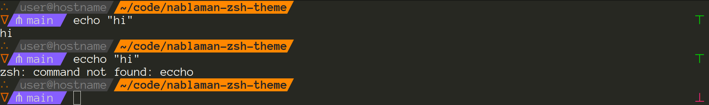

# nablaman

A prompt theme for ZSH (to be used with Oh My Zsh).




## installation

Assuming you have [Oh My Zsh](https://ohmyz.sh/) installed, you can run the following
command to install this theme:

```sh
sh -c "$(curl -o $ZSH_CUSTOM/themes/nablaman.zsh-theme https://raw.githubusercontent.com/kokkonisd/nablaman-zsh-theme/main/nablaman.zsh-theme)"
```

You can then set the profile in your `.zshrc` file:

```sh
ZSH_THEME="nablaman"
```

It is recommended that you use Monokai dark or a similar terminal profile.
